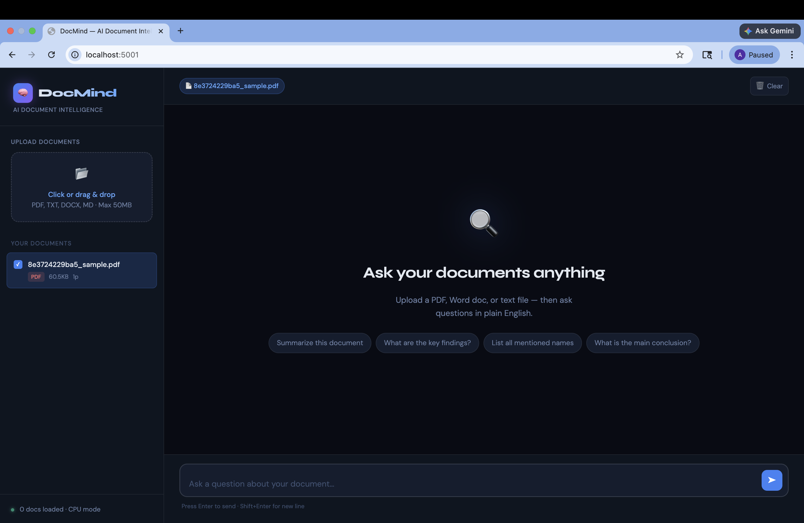
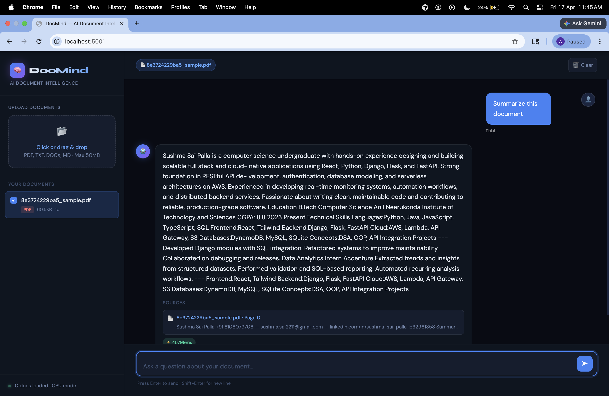
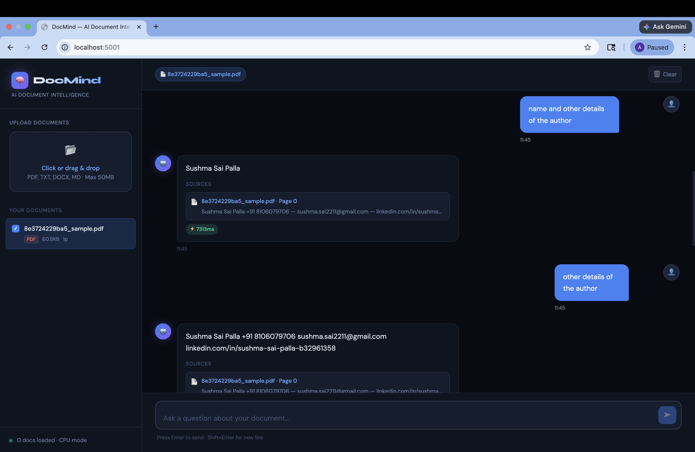

DocMind is an AI-powered application that allows users to upload documents and ask questions in natural language, generating accurate answers using semantic search and large language models.

---

## Features

• Natural language → document question answering
• AI-powered contextual understanding
• Semantic search using FAISS
• Source-based answer generation
• Clean full-stack architecture

---

## Tech Stack

**Frontend**

* HTML
* CSS
* JavaScript

**Backend**

* Flask
* Python

**AI Layer**

* LangChain
* HuggingFace Transformers
* Sentence Transformers

**Vector Database**

* FAISS

---

## System Architecture

User Query
↓
Frontend (HTML/CSS/JS)
↓
Flask Backend API
↓
LangChain Pipeline
↓
FAISS Vector Store
↓
HuggingFace LLM
↓
Answer + Sources

---

## Demo Screenshots

### frontend

---

## Running the Project

### Backend

pip install -r requirements.txt
python app.py

---

## Author

Sushma Sai Palla
